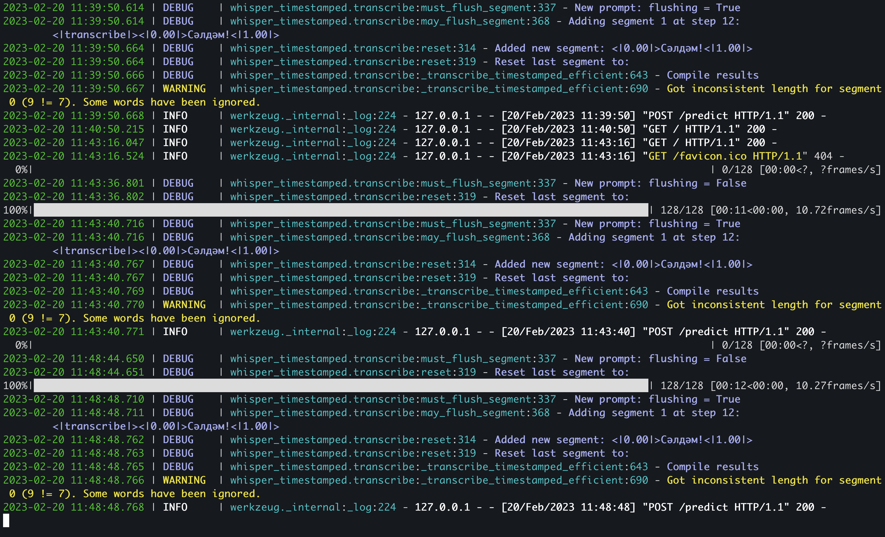
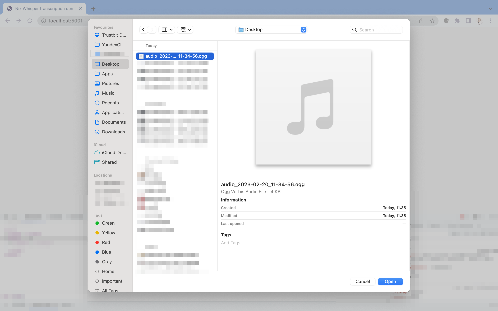
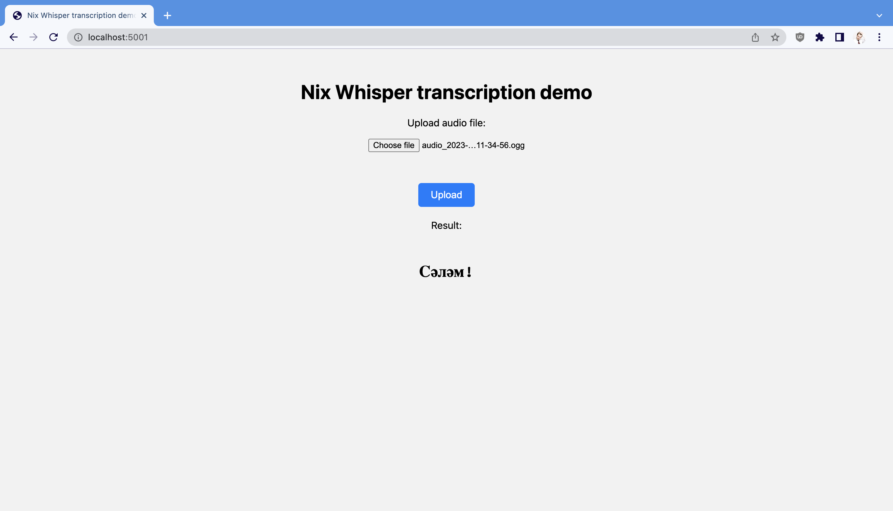

# Nix flake environment for a sample Python project scaffolding for Machine Learning (whisper)

This is a Nix flake environment for developing a sample Python project scaffolding for Machine Learning using whisper and the following dependencies:

* Python 3.10
* ffmpeg
* loguru
* flask
* torch
* pandas

The `mkShell` function is used to create a development shell that includes all these dependencies, as well as any dependencies listed in the requirements.txt file. The shell is created in a virtual environment located in the `./.venv` directory.

To use this flake, you need to have Nix installed. Once you have Nix installed, you can clone this repository and run the following command in the repository directory:

`nix develop`

This will create a development shell with all the required dependencies installed and You will have venv shell automaticly.

You can use this environment to develop a machine learning project using whisper. Whisper provides a set of tools for building, training and testing neural networks in PyTorch.

The `src` directory in this project includes a sample Python module `nix_python` that uses whisper to run a neural network. You can modify this module to build and train your own neural network models.

The flake also includes a buildPythonPackage for a package named "nix-python", which is built using the pyproject format. The package includes the dependencies listed above, as well as the setuptools package. 

Enjoy your machine learning development environment with whisper!

## Usage

If you have our recommended configuration of [Nix data science VM](https://github.com/trustbit/nix-data-science-vm), then to use this setup:

1. Check out this repository and open the folder
2. `direnv allow` to permit direnv to operate
3. **Automatic**: direnv and Nix will ensure exact python version, virtual environment and binary dependencies.
4. `pip install --editable .` - install python project for editing. This will also create `serve` command.

Further in the example will be used a [Bashkir Langiage speech-to-text transcription model](https://huggingface.co/AigizK/whisper-medium-ba) 

You can execute `serve` and should get the output like:

You can open your browser at [http://127.0.0.1:5001](http://127.0.0.1:5001) to view a web UI:

Select any ogg and mp3 files that contain language [sample](sample.ogg) by **Choose the file** button:

Cick on Upload button and wait for a moments for resutl:

GPU is not required, demo app will run on CPU, but on GPU the application will run much faster. If GPU support is available, the application will switch to using the GPU automatically.

## More training details

1. The model is fine-tuning with the HuggingFace scripts: https://github.com/huggingface/community-events/tree/main/whisper-fine-tuning-event
2. The openai/medium model with 769M parameters was used as a basis.
3. We used Common Voice dataset: https://commonvoice.mozilla.org/ba/datasets 
4. To train the model we used our TrustBit server: AMD EPYC 7452 32-Core Processor, RTX 3090 GPU, 128 GB RAM

## Implementation Details

- Using direnv and nix flakes for automated dependency management
- Using pyproject.toml for project metadata ([PEP621](https://peps.python.org/pep-0621/) and [Project Metadata](https://packaging.python.org/en/latest/specifications/declaring-project-metadata/#declaring-project-metadata))
- Setuptools as the default build system
- Modules go into `src` folder
- Dockerfile that support install flakes from Github
